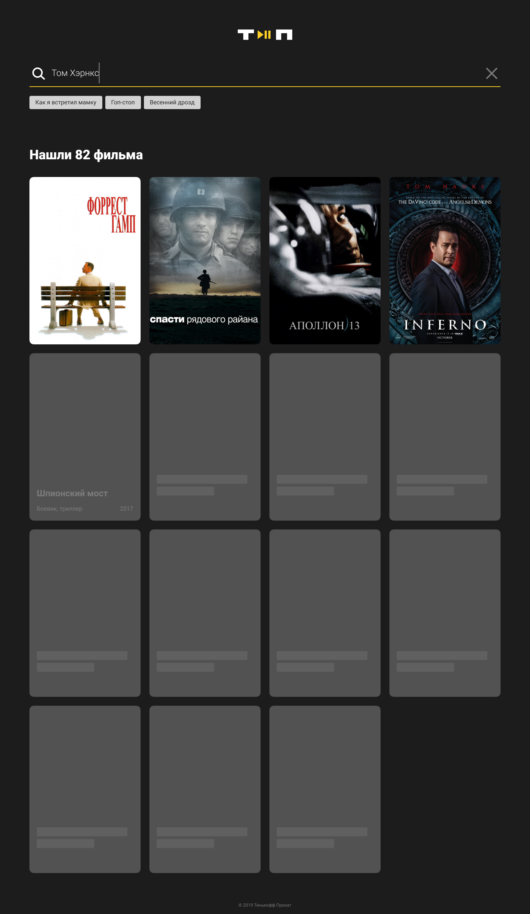

#### There are 4 states (only one of them is showing)

1. Input is not active
2. Results of a search
3. No results found
4. The page is scrolled down

***

#### The following components are implemented:

* Header
* Input
* Results
* Footer
___

#### Input component has 3 states:

* Default
* In focus
* Full width

---

#### Results component has 3 states:

* The search has not been performed
* Smth found
* Not found
---

#### _Реализовано 4 состояния (единовременно отображается лишь одно из них):_

1. _Поиск ещё не выполнялся_ 
2. _Поиск с результатами_
3. _Поиск без результатов_
4. _Страница проскроллена вниз_

***

#### _На странице реализованы блоки:_

* _"заголовок"_
* _"строка поиска"_
* _"результаты поиска"_
* _"подвал"_

***

#### _У блока "строка поиска" 3 состояния:_

* _"обычное не в фокусе"_
* _"обычное в фокусе"_
* _"на всю ширину экрана"_

***

#### _У блока "результаты поиска" 3 состояния:_

* _"поиск ещё не выполнялся"_
* _"есть результаты"_
* _"ничего не найдено"_

***

* _У блока "строка поиска" есть набор тегов, который не помещается по ширине и перенос тегов на следующую строку происходит согласно макету_

* _При наведении курсора на крестик в строке поиска он подсвечивается_

* _В списке фильмов есть "плитки" во всех возможных состояниях: "загрузка", "есть текст, нет постера", "есть постер"_
___

___

___

____
